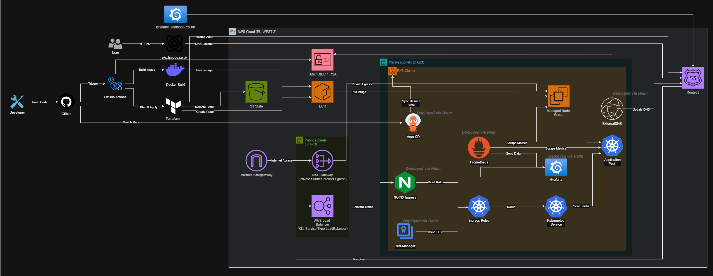

## End-to-End Production Kubernetes Platform on AWS EKS

## Contents
- [Architecture Diagram](#architechture-diagram)
- [Project Demo](#project-demo)
- [Tech Stack](#tech-stack)
- [Project Overview](#project-overview)
- [Docker Image Build & Local Validation](#step-1--docker-image-build--local-validation)
- [Infrastructure as Code Terraform Setup](#step-2--infrastructure-as-code-terraform-setup)
- [CI/CD Pipeline & Security Scanning](#step-3--cicd-pipeline--security-scanning)
- [Kubernetes & kubectl Configuration](#step-4--kubernetes--kubectl-configuration)
- [Helm Deployment Setup](#step-5--helm-deployment-setup)
- [NGINX Ingress Controller](#step-6--nginx-ingress-controller)
- [GitOps with ArgoCD](#step-7--gitops-with-argocd)
- [Cert-Manager & HTTPS Automation](#step-8--cert-manager--https-automation)
- [ExternalDNS Automation](#step-9--externaldns-automation)
- [Prometheus & Grafana Monitoring](#step-10--prometheus--grafana-monitoring)
---

## Architechture Diagram

## Project Demo

https://www.loom.com/share/261b0bff46ce4b328be2915450f97147

## 🛠️ Tech Stack
- AWS (EKS, VPC, ALB, IAM)
- Terraform (Infrastructure as Code)
- Docker (Containerisation)
- Kubernetes (EKS)
- Helm (Application Packaging)
- ArgoCD (GitOps Deployment)
- GitHub Actions (CI/CD)
- Prometheus & Grafana (Monitoring)
- ExternalDNS & Cert-Manager (DNS & TLS Automation)

## Project Overview
This project demonstrates a production-grade Kubernetes deployment on AWS EKS using modern DevOps practices.

Infrastructure is provisioned using Terraform modules, while CI/CD pipelines automate Docker image builds and deployments.

GitOps is implemented using ArgoCD, which continuously syncs Kubernetes manifests from GitHub to the cluster.

The platform includes automated DNS management and TLS certificates, along with monitoring via Prometheus and Grafana.

The result is a fully automated, secure, and scalable cloud-native application deployment accessible over HTTPS.

## Step 1 – Docker Image Build & Local Validation

The application was first containerised and tested locally before any cloud infrastructure was introduced.

A Docker image was built from the application source code to confirm that the Dockerfile, dependencies, and runtime configuration were working correctly.

The container was then run locally and exposed through a local port to verify that the application started successfully and could be accessed in the browser.

## Step 2 – Infrastructure as Code (Terraform Setup)

The AWS infrastructure was designed and implemented using Terraform, following a modular and production-style approach.

A dedicated bootstrap phase was introduced to resolve the “chicken-and-egg” problem of remote state management. This bootstrap configuration provisions the S3 backend required for storing Terraform state securely. The bootstrap was executed manually once, after which all subsequent infrastructure changes are handled via CI/CD.

The main infrastructure was structured using reusable Terraform modules, separating concerns and improving maintainability. These modules were wired together in the root configuration to provision:

- VPC with public and private subnets
- Security groups for controlled network access
- Application Load Balancer (ALB)
- EKS cluster and supporting resources

The configuration ensures proper dependency management through Terraform’s internal graph, allowing resources to be created in the correct order without manual intervention.

Key outcomes of this step:

- Remote state configured using S3 with locking enabled
- Modular Terraform structure for scalability and reuse
- Clean separation between bootstrap and main infrastructure
- All infrastructure components fully defined and connected
- Environment ready for CI/CD-driven deployments

## Step 3 – CI/CD Pipeline & Security Scanning

A CI/CD pipeline was implemented using GitHub Actions to automate the build, security validation, and deployment process.

The pipeline is triggered on changes to the application and infrastructure code, ensuring that all updates are consistently validated and deployed without manual intervention.

Security and quality checks were integrated early in the pipeline to enforce best practices and prevent misconfigurations from reaching production.

The pipeline includes:

- **Terraform Validation** to ensure infrastructure code is syntactically correct  
- **Checkov** for Infrastructure as Code security scanning  
- **Trivy** for container image vulnerability scanning  
- **Docker Build & Push** to Amazon ECR using SHA-based image tagging  
- **AWS Authentication via OIDC** for secure, keyless access  
- **Terraform Plan & Apply** executed through the pipeline (post-bootstrap)  

Additional enhancements:

- **Concurrency control** to prevent overlapping infrastructure deployments  
- **Lock timeout configuration** to handle state contention safely  
- **Separation of bootstrap and main infrastructure execution**  
- **Production-style workflow** where all changes are applied through CI/CD rather than manually  

This ensures that every deployment is secure, repeatable, and fully automated, aligning with production DevOps best practices.

---

## Step 4 – Kubernetes & kubectl Configuration

After the EKS cluster was provisioned, local Kubernetes tooling was configured to allow direct interaction with the cluster.

This included:

- Installing kubectl
- Configuring kubeconfig for EKS access
- Connecting kubectl to the EKS cluster

Once connected, Kubernetes resources could be deployed and managed directly from the local environment.

---

## Step 5 – Helm Deployment Setup

Helm was introduced to simplify Kubernetes deployments and improve configuration management.

The application manifests were converted into reusable Helm charts, allowing deployment values such as:

- Image tags
- Replica counts
- Service ports

to be managed dynamically through values files.

**From this point onward, all additional Kubernetes components—including NGINX Ingress Controller, ArgoCD, Cert-Manager, ExternalDNS, and the Prometheus/Grafana monitoring stack—were deployed and managed using Helm charts**.

This improved deployment consistency and reduced repetitive Kubernetes configuration.

---

## Step 6 – NGINX Ingress Controller

The NGINX Ingress Controller was deployed into the EKS cluster to manage external HTTP and HTTPS traffic into Kubernetes services.

Ingress resources were configured to expose the application externally through a Kubernetes LoadBalancer.

This phase enabled:

- External traffic routing into Kubernetes
- LoadBalancer provisioning within AWS
- DNS accessibility to the application
- Centralised ingress management for Kubernetes services

The application was successfully accessible externally through the ingress controller.

---

## Step 7 – GitOps with ArgoCD

ArgoCD was deployed into the EKS cluster to implement a GitOps workflow.

ArgoCD continuously monitors the GitHub repository and automatically synchronises Kubernetes manifests and Helm chart changes into the cluster.

An `application.yaml` resource was created to define the GitOps deployment configuration, including:

- GitHub repository source
- Target Kubernetes namespace
- Helm chart path
- Automatic sync policy

This allowed ArgoCD to continuously watch the repository and automatically apply any new Kubernetes or Helm changes directly into the cluster.

The setup established fully automated GitOps-based deployments from GitHub into Kubernetes without requiring manual kubectl deployments.

---

## Step 8 – Cert-Manager & HTTPS Automation

Cert-Manager was deployed into the Kubernetes cluster to automate TLS certificate management.

AWS Route53 was used for DNS validation to allow automatic certificate issuance.

ClusterIssuer resources were configured to request and manage certificates for Kubernetes ingress resources.

This enabled:

- Automated HTTPS certificate generation
- Automatic certificate renewal
- Secure HTTPS access to applications exposed through ingress
- Integration between Kubernetes ingress and Route53 DNS validation

---

## Step 9 – ExternalDNS Automation

ExternalDNS was deployed to automate DNS record management for Kubernetes ingress resources.

The setup was implemented using a Helm chart, allowing ExternalDNS to be installed and configured cleanly through Kubernetes values rather than manual manifests.

Terraform was used to provision the required IAM permissions for Route53 access. IAM Roles for Service Accounts were configured so the ExternalDNS pod could securely assume an AWS IAM role without using static AWS access keys.

The Terraform configuration included the required Route53 permissions and was connected to the EKS OIDC provider so ExternalDNS could authenticate securely from inside the cluster.

This enabled ExternalDNS to automatically detect Kubernetes ingress hostnames and create or update the correct DNS records in Route53.

This removed the need to manually create DNS records and allowed application domains to be managed directly from Kubernetes ingress configuration.

---

## Step 10 – Prometheus & Grafana Monitoring

Prometheus and Grafana were deployed as the final observability layer for the EKS platform.

The monitoring stack was installed using Helm, providing a repeatable and maintainable way to deploy monitoring components into the Kubernetes cluster.

Prometheus was used to collect metrics from the cluster, including pods, nodes, namespaces, and services.

Grafana was used to visualise these metrics through dashboards, giving visibility into the health and performance of the Kubernetes environment.

The monitoring setup provides visibility into:

- Pod health and status
- Node resource usage
- CPU and memory consumption
- Namespace-level metrics
- Service and workload performance
- Ingress-related traffic visibility

Grafana was exposed through the existing NGINX ingress setup, with ExternalDNS automatically creating the Route53 DNS record and Cert-Manager provisioning and renewing the HTTPS certificate.

This completed the platform by adding observability on top of the automated EKS, GitOps, DNS, and TLS workflow.

## Conclusion

This project demonstrates the design and implementation of a fully automated, production-grade Kubernetes platform on AWS EKS.

It combines Infrastructure as Code with Terraform, secure CI/CD with GitHub Actions, GitOps with ArgoCD, automated DNS and TLS management using ExternalDNS and Cert-Manager, and full observability through Prometheus and Grafana.

The result is a scalable, secure, and maintainable cloud-native platform that reflects real-world DevOps and Platform Engineering practices.